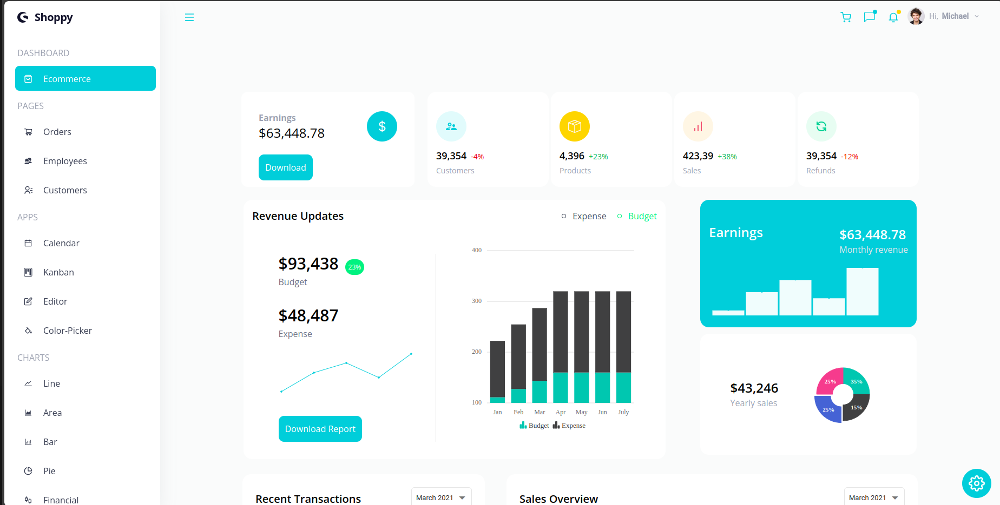
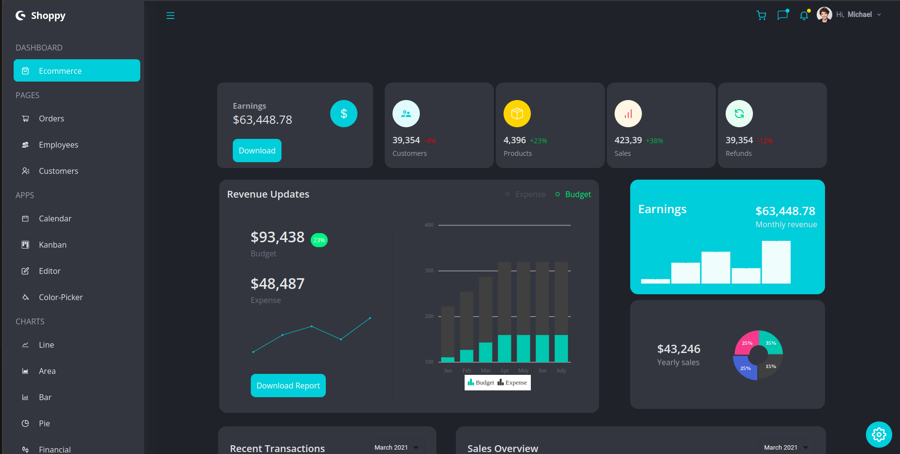
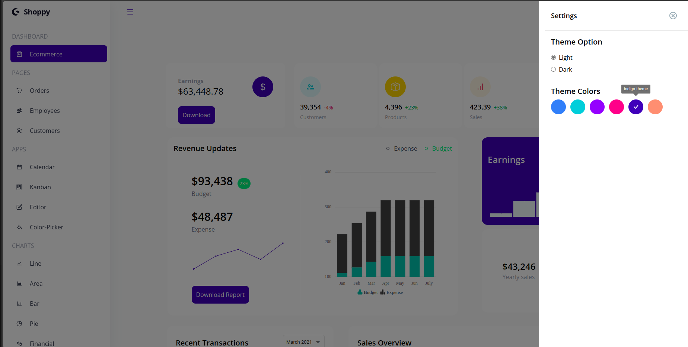

# React-TailwindCSS Dashboard

This is a React-based dashboard application utilizing various Syncfusion components for enhanced functionality and user experience.

## Table of Contents
- [Overview](#overview)
- [Features](#features)
- [Installation](#installation)
- [Usage](#usage)
- [Screenshots](#screenshots)
- [Live Demo](#live-demo)
- [Dependencies](#dependencies)
- [Contributing](#contributing)

## Overview
This dashboard application is designed to provide a robust and responsive user interface using React and Tailwindcss. It incorporates a variety of Syncfusion components such as calendars, charts, dropdowns, grids, inputs, kanban boards, popups, rich text editors, and schedules to create a dynamic and interactive user experience.

## Features
- Responsive with dark theme and custom styles
- Interactive and customizable charts
- Advanced calendar and scheduling functionality
- Rich text editing capabilities
- Dynamic and responsive grids
- Comprehensive form controls and inputs
- Kanban board for task management
- Popups and modals for enhanced UI interactions

## Installation
To get started with the React Dashboard, follow these steps:

1. Clone the repository:
    ```sh
    git clone https://github.com/your-username/react-dashboard.git
    cd react-dashboard
    ```

2. Install the dependencies:
    ```sh
    npm install
    ```

3. Start the development server:
    ```sh
    npm start
    ```

The application will be available at `http://localhost:3000`.

## Usage
To use the React Dashboard, follow the installation steps above. Once the development server is running, you can access the application in your web browser.


## Screenshots
Here are some screenshots of the React Dashboard:

### Dashboard Overview Light-Theme


### Dashboard Overview Dark-Theme


### Dashboard Overview Custom-Theme


## Live Demo
Check out the live demo for more details [here](https://reactjs-dashboard-tailwindcss.netlify.app/).

## Dependencies
This project uses the following dependencies:

- **React**: ^17.0.2
- **React DOM**: ^17.0.2
- **React Icons**: ^4.3.1
- **React Router DOM**: ^6.2.1
- **Syncfusion Components**:
  - `@syncfusion/ej2`: ^19.4.48
  - `@syncfusion/ej2-react-calendars`: ^19.4.48
  - `@syncfusion/ej2-react-charts`: ^19.4.50
  - `@syncfusion/ej2-react-dropdowns`: ^19.4.52
  - `@syncfusion/ej2-react-grids`: ^19.4.50
  - `@syncfusion/ej2-react-inputs`: ^19.4.52
  - `@syncfusion/ej2-react-kanban`: ^19.4.48
  - `@syncfusion/ej2-react-popups`: ^19.4.52
  - `@syncfusion/ej2-react-richtexteditor`: ^19.4.50
  - `@syncfusion/ej2-react-schedule`: ^19.4.50

## Contributing
Contributions are welcome! Please fork the repository and create a pull request with your changes. Ensure that your code adheres to the project's coding standards and includes appropriate tests.

1. Fork the repository
2. Create a new branch (`git checkout -b feature-branch`)
3. Commit your changes (`git commit -am 'Add new feature'`)
4. Push to the branch (`git push origin feature-branch`)
5. Create a new pull request
